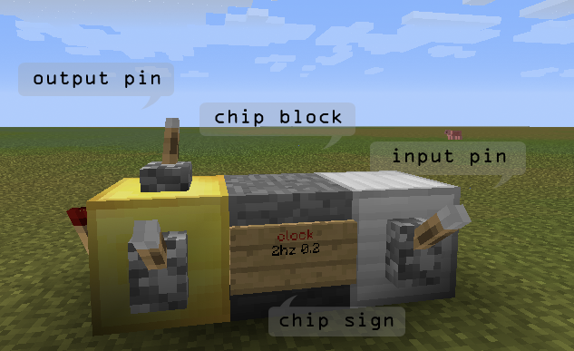

- [Building a chip](#building_a_chip)
- [Debugging](#debugging)
- [Destroying a chip](#destroying_a_chip)
- [Chip detection scanning rules](#chip_detection_scanning_rules)
- [Plugin commands](/commands.html)
- [Preference keys](#preference_keys)
- [Permissions](#permissions)
- [Writing chip libraries](#writing_chip_libraries)

Building a Chip
---------------

- Start by building the chip __structure__ out of any block you want. You can't use sand or gravel. The block material must be different than the input/output/interface materials (see below).
- Place a __wall sign__ attached to one of the chip blocks. This will be the starting point of the chip and affects the order of I/O pins. Set the sign text according to the circuit type you're trying to build. See the [circuitdocs](/circuitdocs) for more info.
- Add __output blocks__ (gold block by default) and __input blocks__ (iron block by default). Each I/O block has to be attached to one of the structure blocks. 
- Some circuits, such as [synth](/circuitdocs/Synth.html) require you to add __interface blocks__ (lapis blocks by default). Again, make sure that each interface block is attached to a structure block. The circuit will then use blocks on any side, on top, or below as a point of interaction with the "physical" world or the player. In the case of the synth circuit, it will play a note on any noteblock attached to its interface blocks.
- Last but not least, go back to your circuit sign and __right-click__ it to activate the chip. If all went well, you should receive an activation message. 

An input block can receive redstone signal from the block above it or from any block on its sides.
An output block sends its signal to any compatible device that's attached to its sides or to its top. Possible output devices are __levers__, 
__redstone torches__, __powered rails__, __doors__, __trap doors__, and __note blocks__. When the output block doesn't have any attached devices 
it will directly send signal to any input pin whose block is touching the output block. 

###Output devices

The order of the input and output blocks is very important as different pin numbers have different functions. In simple circuit structures the 
pin numbering starts at the chip sign onwards. The pin to the right of the sign will always come before the pin to the left. 
See [Chip detection scanning rules](#chip_detection_scanning_rules) below, for information on finding the order of pins in more complex 
structures.

A clock, counter and two synth chips connected directly to each other forming a more complex structure. 

###One block chips
When all you need is a chip with one i/o block, a sign can be directly attached to the single i/o block without needing any extra chip blocks.

Debugging
---------
There are several commands for investigating problems.

- [/rcdebug](/commands.html#rcdebug_register_yourself_as_a_chip_debugger) - Sends debug messages from any number of chips.
- [/rcpin](#rcpin_prints_information_about_a_chip_pin) - Prints pin number and current state.
- [/rcinfo](#rcinfo_prints_a_lot_of_useful_information_about_a_chip) - Prints info about the current state of the chip.
- [/rcname](#rcname_name_or_unname_a_circuit_for_easier_debugging) - Give names to chips to be able to identify them better.
- [/rcenable](#rcenable_enables_a_disabled_chip), [/rcdisable](#rcdisable_disables_a_chip) - Disable parts of you circuit to find problems easier.
- [/rctool](#rctool_turns_the_item_in_your_hand_into_a_chip_probe) - Define a chip probe that prints information when right-clicking chip blocks.

Destroying a Chip
-----------------
You can destroy a chip by breaking any of its structure blocks, or by running the /rcbreak command while pointing at a circuit block. Use `/rcdestroy` to destroy the chip and remove all of its blocks. 
__Creepers__, __TNT__ explosions and __fire__ (in case you're using flammable blocks) will also cause the chip to stop functioning.
Destroying a chip block with __Power tools__ or worldedit commands, however, will not cause the chip to decativate until the server shutdowns, and can result in "phantom" circuits still taking place in memory. Whenever the plugin saves data invalid chips should be deactivated. Running /rcsave to force saving.

Chip scanning rules
-----------------------------
To be able to guess the pin numbering of more complex structures you need to understand how the plugin scans the chip structure once you activate one. The chip is scanned block by block starting with the sign block. The pins are numbered as the chip structure is scanned, when the structure is a straight line the numbers start at the sign onwards. When the structure is more complex it will be scanned according to the following rules:

- The sign block is added to the structure and then the plugin moves to the chip block the sign is attached to. 
- It will try to find input, output or interface blocks at any of the other sides of the chip block and above or below. The important part is the order in which different sides are scanned. First, it will look to the right (relative to the current scan direction), next it will look to the left. After that it will look at the next block in the original direction and finally it will look back, opposite to the scan direction. Finally it checks the block above and below. If going backwards seem like a waste of time see the next point. 
- Now the plugin will go to the next chip block. The scan order is 
	- The block to the right, relative to the current scan direction.
	- The block to the left, relative to the current scan direction.
	- The block in the same direction as before.
	- The block in the opposite direction.
	- One block up. If the block above is a chip block the scan will continue in the same direction as before only one level above.
	- One block below. Will also continue in the same direction.

	
One very important thing to note is that the recursive scanning process work by branches. It will continue going from block to block in one direction even when chip blocks are found in other directions. Only when it reaches a dead end it will go back to try the other branches.

For more details see the [CircuitManager](http://github.com/eisental/RedstoneChips/blob/master/src/main/java/org/tal/redstonechips/ChipScanner.java) class. 

Preference keys
---------------
To change any of the preferences while playing, you can use the `/rcprefs` command. All values are stored in `<craftbukkit folder>/plugins/RedstoneChips/preferences.yml`.

### Block types - these can be any material name or id. 
- `inputBlockType` - Sets the input indicator block material (`IRON_BLOCK` by default).
- `outputBlockType` - Sets the output indicator block material (`GOLD_BLOCK` by default).
- `interfaceBlockType` - Sets the interface indicator block material (`LAPIS_BLOCK` by default).

To add specific data values use `<material name/id>:<data value>` such as `wood:2` for example for birch wood. Using specific wool colors is also possible, `wool:yellow` for example.

### Message colors - these can be any chat color name.
- `infoColor` - Color of info messages (`GREEN` by default)
- `errorColor` - Color of error messages (`RED` by default)
- `debugColor` - Color of debug messages (`AQUA` by default)

### Other 
- `enableDestroyCommand` - Enable or disable /rcdestroy command. Possible values are `true` or `false` (`false` by default).
- `signColor` - Sets the text color used for the circuit name when the circuit is activated. A hex code between 0-f. 4 (red) by default.
- `maxInputChangesPerTick` - Sets the maximum number of input pin state changes per game tick. When this limit is reached the infinite loop detector is switched on and the 
chip is disabled. Set to 20000 changes per tick by default.
- `usePermissions` - When set to true the plugin will use the permission system if a permissions plugin is installed. `false` by default.
- `checkForUpdates` - Determines whether the plugin will check for new versions on server startup. `true` by default.

[Plugin commands](commands.html)
----------------

Permissions
-----------
To use RedstoneChips permissions you must have a permissions plugin on your server. To activate permissions support enter: `/rcprefs usePermissions true`. Protected channels can be used also when usePermissions is set to false.

###Command permissions

`/rchelp <command name>` displays all permission node that are associated with a command.

All commands have an "allow" and "deny" permission. The "deny" permission overrides the "allow" permission. This can be used if a user belongs to a group which allows a command that you need to explicitly deny the user. 

###Chip permissions
All chips have create and destroy permissions. These also have an "allow" and "deny", which function identically as above. Destruction protection prevents a chip from being destroyed via RC commands or by breaking the blocks that make up the circuit. The following node types can be used:

- `redstonechips.circuit.destroy.\*` - allows destroying any circuit type.
- `redstonechips.circuit.destroy.deny` - denies destroying any circuit type.
- `redstonechips.circuit.<chip-name>;` - allows destroying a specific circuit type.
- `redstonechips.circuit.<chip-name>.deny` - denies destroying a specific circuit type.

###Protected channels
Protecting channels allow users to control who can create and destroy wireless chips on particular channels. This system is independent of the other permissions and functions even when permissions are disabled. Users can define admins for the channel, who can change who has access to the channel, and users, who can create chips using the channel, but can not change access. `/rcchannels` does not show a user any channels that they do not have access to, and protected channels the user does have access to are shown with a "P" to identify they are protected. `/rcchannels <channel name>` will show all authorized users and admins of the channel. Use the command `/rcprotect` to manage protected channels. 

###Top-level permission nodes
- `redstonechips.admin`: Grants access to all of RedstoneChips including admin commands.
- `redstonechips.*`: Grants access to all of RedstoneChips excluding admin commands.
- `redstonechips.deny`: Denys access to all of RedstoneChips.
- `redstonechips.command.*`: Grants access to all of RedstoneChips commands excluding admin commands.
- `redstonechips.command.admin`: Grants access to all of RedstoneChips commands including admin commands.
- `redstonechips.command.deny`: Deny all commands.
- `redstonechips.circuit.*`: Grants access to create and destroy all RedstoneChips circuits.
- `redstonechips.circuit.deny`: Deny all building or destroying circuits.

Writing chip libraries
-------------------------

Chip libraries are essentially bukkit plugins that provide RedstoneChips with new chip types. If you have a solid understanding of Java, writing your own chips should be easy enough. 

These should help you get started:

- [Library template](http://github.com/eisental/LibraryTemplate).
- [API documentation](/RedstoneChips/apidocs).

Don't hesitate to ask any question by mail or on the forum.