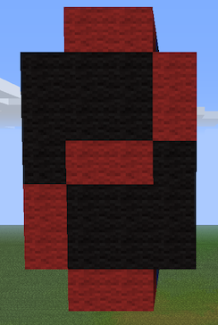
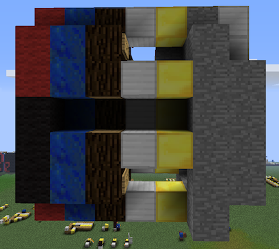
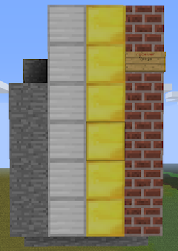
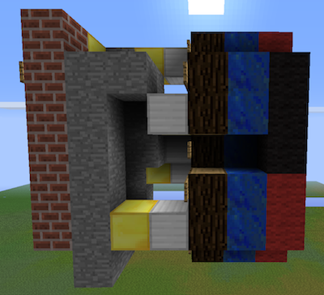
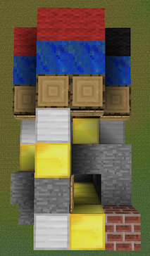

A simple 7-segment wool display. Made of 7 [pixel](../circuitdocs/Pixel.html) chips, a [segdriver](../circuitdocs/Segdriver.html) and a [receiver](../circuitdocs/Receiver.html).

The digit uses a 5-bit wireless channel. bit 0 is the blank pin (when set to 1 the display blanks out). Bits 1-4 set the displayed digit. You should probably change the receiver channel to something more original than "7segs".
To display numbers with more than 1 digit use [bintobcd](../circuitdocs/Bintobcd.html) chip.

###[download .schematic](7segdigit.schematic)

###[download old version .schematic](7segdigitPRE0.93.schematic) if you're using a pre 0.93 plugin version.

* * *

