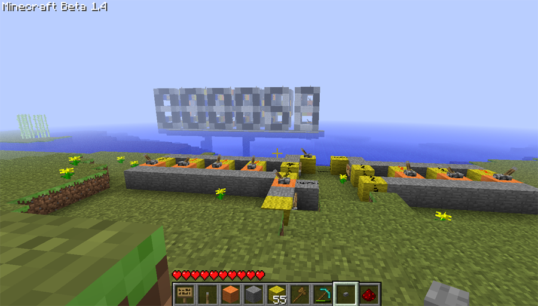
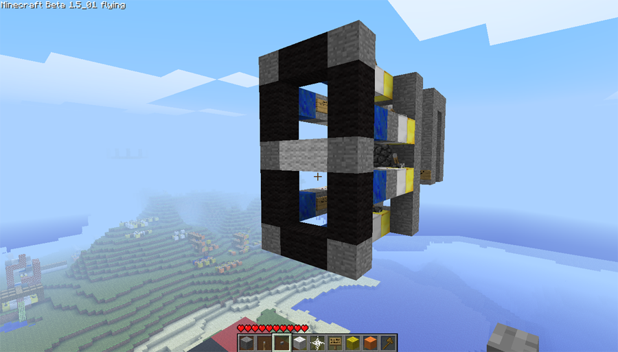
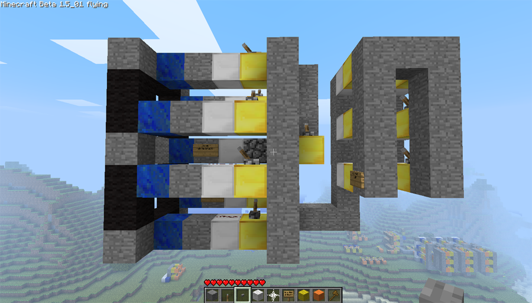
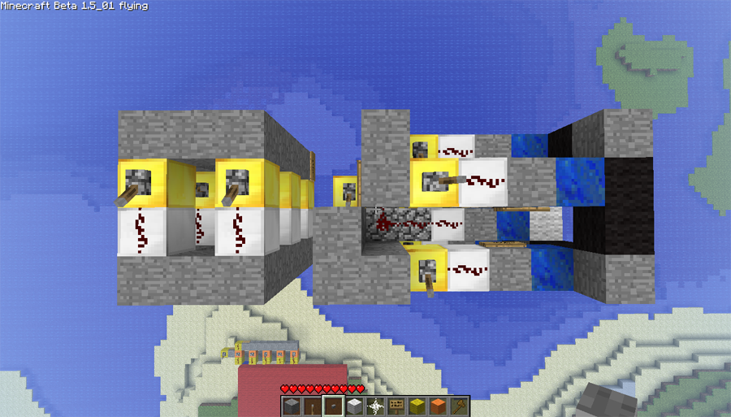
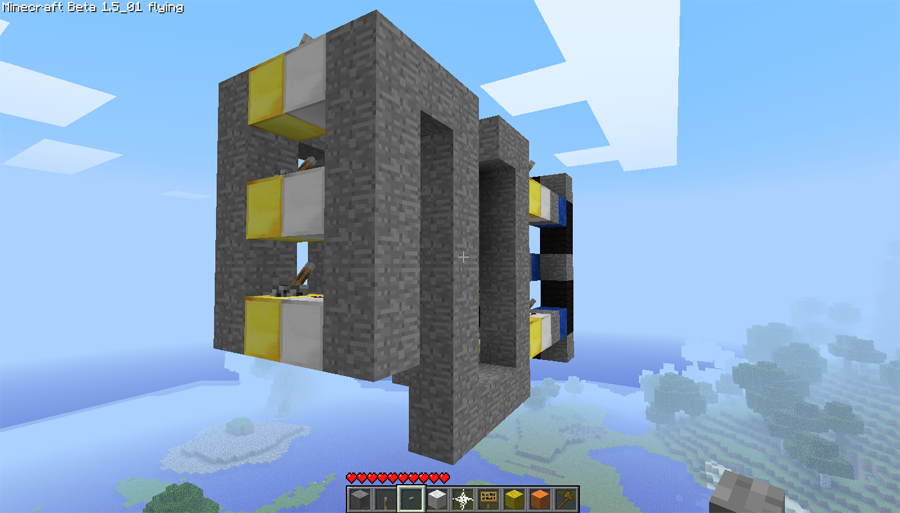
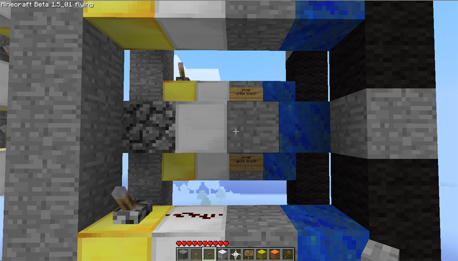

A simple 7-segment wool display. Made of 7 [pixel](../circuitdocs/Pixel.html) chips, a [segdriver](../circuitdocs/Segdriver.html) and a [receiver](../circuitdocs/Receiver.html).

Send a 4-bit number over the receiver channel in order to display it on the digit. You should probably change the receiver channel to something more original than "digit".
To display numbers with more than 1 digit use a [bintobcd](../circuitdocs/Bintobcd.html) chip.

###[Download .schematic](7segdigit.schematic)

* * *

